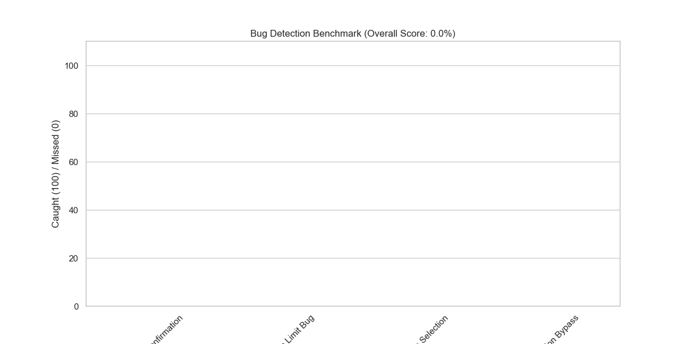

# Bug Detection Benchmark Report

- **Total Bugs Tested:** 4
- **Bugs Caught:** 0
- **Detection Rate:** 0.00%

## Detailed Results

| Bug Name | Caught | Reason |
| --- | --- | --- |
| Missing Confirmation | ❌ | Execution Error: 404 models/gemini-1.5-flash is not found for API version v1beta, or is not supported for generateContent. Call ListModels to see the list of available models and their supported methods. |
| Selection Limit Bug | ❌ | Execution Error: 404 models/gemini-1.5-flash is not found for API version v1beta, or is not supported for generateContent. Call ListModels to see the list of available models and their supported methods. |
| Past Date Selection | ❌ | Execution Error: 404 models/gemini-1.5-flash is not found for API version v1beta, or is not supported for generateContent. Call ListModels to see the list of available models and their supported methods. |
| Validation Bypass | ❌ | Execution Error: 404 models/gemini-1.5-flash is not found for API version v1beta, or is not supported for generateContent. Call ListModels to see the list of available models and their supported methods. |

